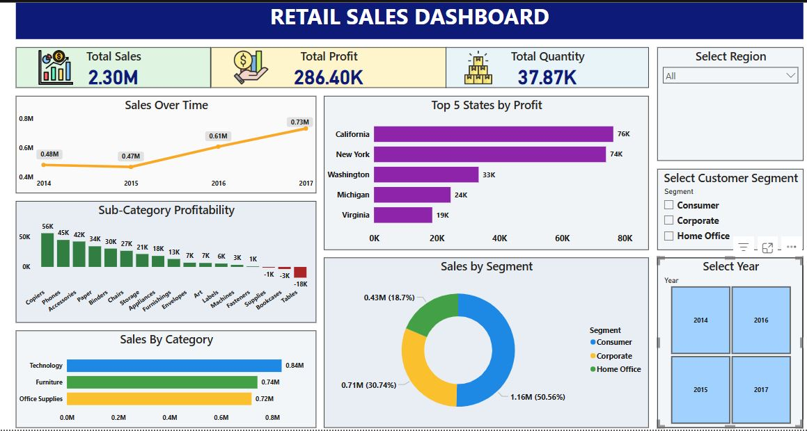

# 🛒 Retail Sales Analysis Dashboard (Power BI)

This Power BI dashboard presents a detailed analysis of a retail dataset, highlighting key performance indicators such as total sales, profit, quantity sold, and category-wise breakdown. It enables businesses to understand trends, discover profitable segments, and make data-driven decisions.

---

## 📊 Key Highlights

- **Total Sales:** $2.30M  
- **Total Profit:** $286.4K  
- **Total Quantity Sold:** 37.87K

### 🧩 Key Visualizations

- **Sales Over Time:** Year-wise trend (2014–2017)
- **Top 5 States by Profit:** E.g., California, New York, Washington
- **Sub-Category Profitability:** Most and least profitable sub-categories
- **Sales by Category:** Technology, Furniture, Office Supplies
- **Sales by Segment:** Consumer, Corporate, Home Office

---

## 💡 Business Insights

- **Technology** leads in revenue, followed by Furniture and Office Supplies.
- **California** and **New York** drive the highest profits.
- Sub-categories like **Tables** and **Bookcases** underperform.
- The **Consumer segment** is the most dominant (50.56% of sales).

---

## 🎛️ Interactive Filters

- **Region Selector**
- **Customer Segment Selector**
- **Year Selector**

These slicers help users drill down into specific time periods, customer groups, or geographic regions.

---

## 📸 Dashboard Preview

---

## 📁 Repository Structure

📦 retail-sales-dashboard/
┣ 📄 Retail_Sales_Dashboard.pbix
┣ 📁 screenshots/
┃ ┗ retail-dashboard.png
┗ 📄 README.md

---

## 🚀 How to Use

1. Clone or download this repository.
2. Open the `.pbix` file in **Power BI Desktop**.
3. Use the interactive filters to explore the data dynamically.

---

## 🛠 Tools Used

- Power BI Desktop
- DAX & Data Modeling
- Superstore Sample Dataset

---

